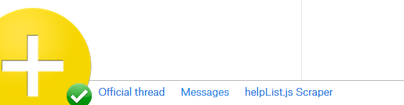

# Dropbox Forum Extender+
The Dropbox Forum Extender+ is a Greasemonkey plugin for the Dropbox Forums. The script adds many features to the forums to make it easier to create and respond to threads.

## How to Install
The easiest way to install the userscript is to use the RAW link to [forum-extender-plus.user.js](forum-extender-plus.user.js) by clicking the Raw button at the top of the file contents. Alternatively, you can download the ZIP and install the user.js file via drag and drop, copy and paste the source, or use the RAW link to the file.

## Features
Dropbox Forum Extender+ adds many features to the forums in order to make working with the forums easier

### Easy post tools
The built in markup options for posts are pretty extensive. However, we've enhanced the existing tools to bring you much more functionality.

> **Links for markup** - Adding markup is now easier than ever with one click links for things like lists or links.

> **Post drafting** - If you're writing a fairly extensive post, and you want to save your progress, or pick up where you left off later, you can save drafts. This allows you to save a snapshot of the content of the post form and later update the draft, or restore from it on a per thread basis. This means you can have up to one drafted post at a time per thread on the forums.

> **Post snippets** - For more commonly used responses or links, such as explanations of a feature, or a list of things to accomplish a task with Dropbox, it can be tedious to type out a response that's nearly the same every time. We've added the ability to create predefined snippets, similar to those of a text expansion utility. These snippets can be loaded into the form wherever your cursor currently lies with the click of a button. These snippets can also be added, edited, or deleted at any time from the snippet manager.

> **Help Center quick linking** - If you frequent the forums, you may eventually memorize some of the Help Center numbers. For example, article 175 will give you a rundown of Selective Sync. To save time when linking to these articles, referencing an article can be done via an @ notation (ex: @175). The script will convert all of these notations into clickable links on the fly when the post is submitted.

> Additionally, the @ notation introduces an autocomplete list. If you don't remember the number exactly, a list of all articles matching what's currently typed will pop up, allowing you to select the proper option.

> **Post quoting** - Posts by other users have controls appended to quote a user in your reply. These options allow you to quote either the entire post, or just a selection of text.

### Thread highlighting
With the ever growing list of threads on the forums, for regulars, it can sometimes be hard to quickly go through and answer help threads. Through the use of highlighting, you can now quickly scan to see which threads need response. Fresh threads show highlighted in green, while one or two replies are gold or red respectively.

> 
**New thread** - Highlighted in green

> 
**One reply** - Highlighted in gold

> 
**Two replies** - Highlighted in red

### Navigation bar
The navigation bar fixed to the bottom of the screen provides a quick and simple way to access common tools such as the messaging system or preferences. Use this to quickly open other parts and features of the script.

> **Preferences** - Clicking the gold plus logo opens the userscript preferences.

> **Posts by activity** - A quick link to a list of all threads across all categories sorted by last activity.

> **Posts by create date** - A quick link to a list of all threads across all categories sorted by their creation date.

> **Messaging system** - Most forum platforms offer a messaging backend to talk with other users. The messaging system here provides a simple, yet elegant way of privately talking with other users of the userscript without the need to post anything publicly.

### Preferences menu

With all of the customization the script has to offer, there should be a central place to manage it. The preferences menu allows for easy customization of almost everything without having to manually edit any code.

> **Snippet manager** - The snippet manager allows you to create, delete, and edit post snippets that you can use in your posts. These snippets are similar to text expansion, and allow you to add blocks of text you define into your posts on the fly.

> **Page reloading** - For those that frequent the forums, the script has a built in mechanism for automatically handling timed refreshing of forum pages at a user-defined interval. This ensures that whenever you go back to a list of threads, you always have a list of the most recent threads in front of you.

### Dropbox API integration
The script integrates with the Dropbox API, meaning everything you do goes with you. This means that every computer you link to the userscript will share the same copy of your preferences, snippets, and drafts, preventing you from having to reconfigure them every time you link a new userscript.
